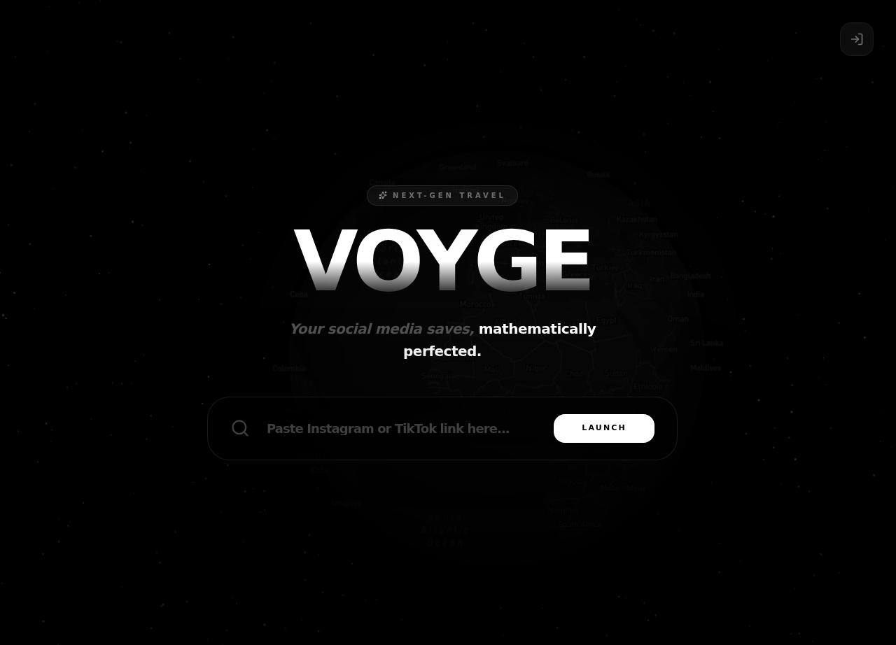

# VOYGE.studio 🗡️


**Your social media saves, mathematically perfected.**

VOYGE.studio is a high-fidelity travel intelligence platform designed to turn fragmented social media "saves" into actionable, optimized itineraries. Built with a Vercel-inspired aesthetic and a "Roamy" mobile-first UX, it bridges the gap between digital inspiration and physical exploration.



## 🗡️ The Why

We all have them: hundreds of bookmarked Reels and TikToks of "hidden gems," aesthetic cafes, and breathtaking viewpoints. But when it actually comes time to travel, those saves remain buried in an endless scroll. 

**VOYGE.studio** solves this by acting as the bridge between digital inspiration and physical exploration. It doesn't just store your spots; it understands them. By combining the precision of **GPT-4o** with the mathematical efficiency of the **Mapbox Optimization Engine**, VOYGE transforms your social media clutter into a logical, day-by-day path.

## 🚀 Core Features

### 1. The Intelligence Engine
*   **Link & Omni-Search:** Paste Reel/TikTok links or search for locations directly with real-time **Mapbox Searchbox** suggestions.
*   **AI Enhancement:** Automatically generates punchy descriptions, category classifications, and vibes for every spot using **GPT-4o**.
*   **Visual Engine:** Integrated with the **Pexels API** to automatically fetch high-quality hero images for every saved location.

### 2. "Roamy" Mobile Experience
*   **High-Fidelity Bottom Sheet:** A Framer Motion-powered interactive drawer for mobile users that mimics native iOS gestures.
*   **Category Chips:** Instant filtering by "Attractions," "Museums," "Food," and more.
*   **Deep Grouping:** Spots are organized by **Country > City/Region** with dynamic emoji flags (e.g., 🇲🇦 Morocco, 🇮🇹 Italy).

### 3. Mathematical Mapping
*   **Master Map:** A unified dark-mode globe view of every spot you've ever saved.
*   **Route Optimization:** Powered by the **Mapbox Optimization Engine** to eliminate travel "zig-zagging."
*   **Native Interactivity:** Smooth "Fly-To" animations and glowing pathing systems.

### 4. Ecosystem Integrations
*   **Telegram Bot (@Voygevercelbot):** Forward Reels directly to your bot to "teleport" them to your map instantly.
*   **iOS Shortcut:** One-tap syncing directly from the Apple Share Sheet.

## 🛠️ Tech Stack

*   **Frontend:** Next.js 16 (App Router) + Tailwind CSS 4 + Framer Motion.
*   **Backend:** Vercel Serverless Functions.
*   **Database & Auth:** Firebase Firestore & Firebase Auth.
*   **Intelligence:** GitHub Models (GPT-4o) + Pexels API + RapidAPI Scrapers.
*   **Geo-Spatial:** Mapbox GL JS v3 + Searchbox API + Optimization API.

## 🗺️ Future Roadmap

- [ ] **AI Trip Narrator:** Generate a full travel guide based on your pinned spots.
- [ ] **Collaborative Maps:** Real-time multi-user editing for group trip planning.
- [ ] **Offline Mode:** Export optimized itineraries to Apple Maps or Google Maps for data-free travel.
- [ ] **Budget Intelligence:** Automatic cost estimation for your planned journeys.
- [ ] **Booking Integration:** Direct links to reserve tables or book tickets for your saved spots.

## 🛡️ Setup & Installation

```bash
# Clone the repository
git clone https://github.com/jip9e/VOYGE.studio.git

# Install dependencies
npm install

# Run development server
npm run dev
```

## 📝 License

Private / Personal Use — see [LICENSE](./LICENSE) for details. 🗡️

## 📋 Changelog

See [CHANGELOG.md](./CHANGELOG.md) for release history.
